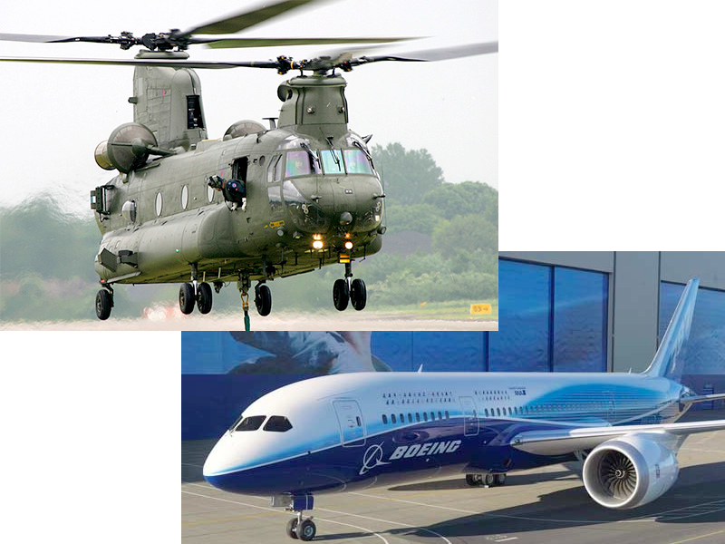

!SLIDE center middle-image-slide

# Boy Scouts of America #
## Merit Badge - Computer Programming ##

!SLIDE bullets
# Activities #

* The Internet and Web Programming
* <b>Examples 1, 2, 4, 5</b> (simple web pages, HTML, forms)
* Sinatra (web software, not the singer)

!SLIDE bullets
# Activities #

* <b>Main Exercise</b>
* Students fill out the merit badge worksheet

!SLIDE

# What can you make with computer programs? #

!SLIDE middle-image-slide center

