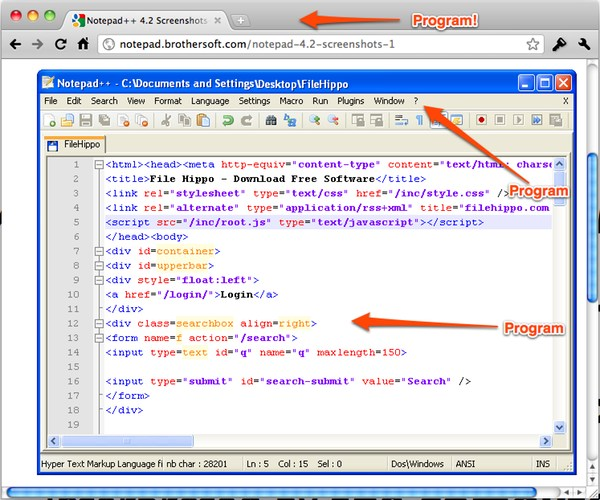
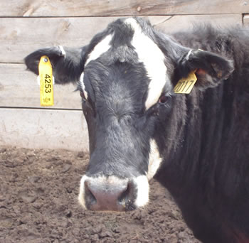
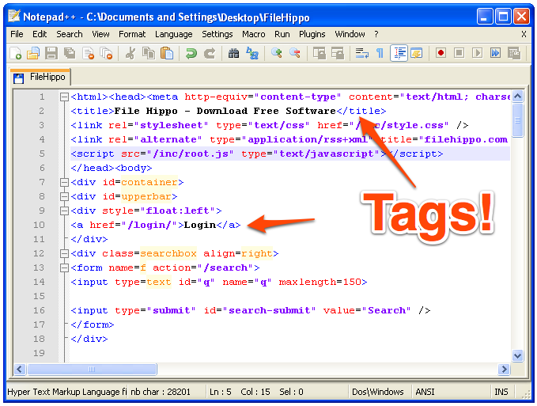

!SLIDE subsection

# Programming #

!SLIDE bullets incremental

* <b><em>Programming</em></b>: Telling a computer to do stuff
* When <em>[something-happens]</em>... 
* Do <em>[something-else]</em> in response
* <b><em>Algorithm</em></b>: Set of steps to follow for solving a problem

!SLIDE bullets

* A <b>program</b> is a set of <b><em>algorithms</em></b> 
* Written by a <b><em>programmer</em></b>
* In the form of <b><em>text instructions</em></b>
* Interpreted by <b><em>the computer</em></b>

!SLIDE middle-image-slide center

## Examples ##

!SLIDE bullets center incremental

* Programming for the web involves <b><em>tags</em></b>

* 

!SLIDE bullets center

* Programming for the web involves <b><em>tags</em></b>

* 

!SLIDE bullets

# Let's look at examples... #

## Starting with: 1-hello_world ##

## (Pssst: It's ok to break stuff & make mistakes) ##
