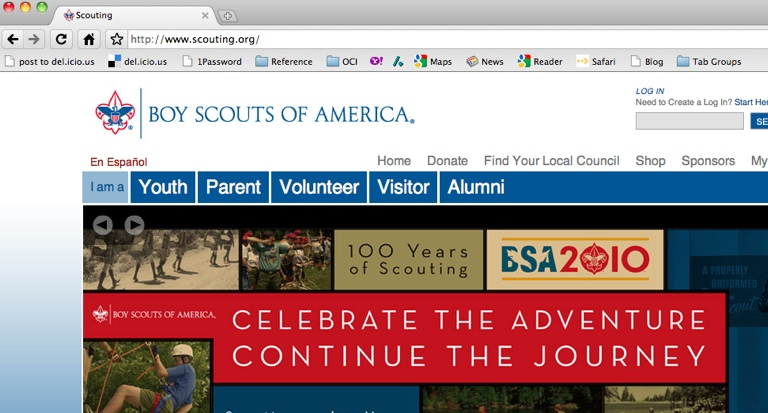

!SLIDE subsection

# The Internet #

!SLIDE bullets

* The <b>internet</b> 
* is about <b>computers talking</b> 
* to each other

!SLIDE bullets incremental

* <em>You</em> computer asks <em>Me</em> computer:
* <b>"Gimme yur websyt, mkay"</b>
* <em>Me</em> computer replies: 
* <b>"Lyk heer it iz, r whatevr"</b> or <b>"Huh?"</b>

!SLIDE bullets incremental

* Computers communicate via a <b><em>protocol</em></b>
* On the web, the protocol is <b><em>HTTP</em></b>
* <em><u>http</u></em>://www.scouting.org/

!SLIDE bullets smaller top-image-slide center

* The address comes after the protocol
* Addresses are unique (like phone numbers)
